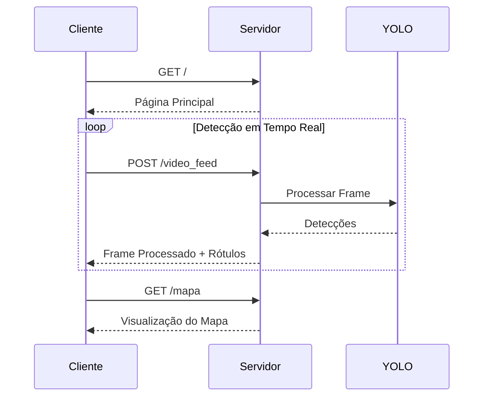

# Documentação de Rotas - Arquitetura Maranhense

Este documento descreve todas as rotas existentes e planejadas para a aplicação Arquitetura Maranhense.

## Rotas Existentes

```mermaid
graph TD
    A[Cliente] --> B[/]
    A --> C[/video_feed]
    A --> D[/mapa]

    B[/] -->|GET| E[Página Principal]
    C[/video_feed] -->|POST| F[Processamento de Frame]
    D[/mapa] -->|GET| G[Visualização do Mapa]

    style E fill:#f9f,stroke:#333,stroke-width:2px
    style F fill:#bbf,stroke:#333,stroke-width:2px
    style G fill:#bfb,stroke:#333,stroke-width:2px
```

### Detalhamento das Rotas Atuais

1. **/** (GET)

   - Rota principal que renderiza a página inicial
   - Arquivo: `templates/index.html`
   - Funcionalidades:
     - Interface para iniciar/parar detecção
     - Visualização da câmera em tempo real
     - Exibição de objetos detectados

2. **/video_feed** (POST)

   - Rota para processamento de frames de vídeo
   - Recebe: Frame da câmera em formato base64
   - Retorna:
     - Imagem processada com detecções
     - Lista de rótulos detectados

3. **/mapa** (GET)
   - Rota para visualização do mapa do Centro Histórico
   - Arquivo: `templates/mapa.html`
   - Funcionalidades:
     - Exibição do mapa estático
     - Botão para retornar à página principal

## Rotas Planejadas

```mermaid
graph TD
    A[Cliente] --> B[/api/deteccoes]
    A --> C[/api/estatisticas]
    A --> D[/api/locais]

    B[/api/deteccoes] -->|GET| E[Lista de Detecções]
    B -->|POST| F[Nova Detecção]

    C[/api/estatisticas] -->|GET| G[Estatísticas Gerais]

    D[/api/locais] -->|GET| H[Lista de Locais]
    D -->|POST| I[Novo Local]
    D -->|PUT| J[Atualizar Local]
    D -->|DELETE| K[Remover Local]

    style E fill:#f9f,stroke:#333,stroke-width:2px
    style F fill:#bbf,stroke:#333,stroke-width:2px
    style G fill:#bfb,stroke:#333,stroke-width:2px
    style H fill:#fbb,stroke:#333,stroke-width:2px
    style I fill:#bff,stroke:#333,stroke-width:2px
    style J fill:#fbf,stroke:#333,stroke-width:2px
    style K fill:#ffb,stroke:#333,stroke-width:2px
```

### Detalhamento das Rotas Planejadas

1. **/api/deteccoes**

   - **GET**: Listar todas as detecções realizadas
   - **POST**: Salvar nova detecção
   - Dados esperados:
     - Tipo do objeto detectado
     - Localização (coordenadas)
     - Timestamp
     - Imagem (opcional)

2. **/api/estatisticas**

   - **GET**: Obter estatísticas gerais
     - Total de detecções por categoria
     - Locais mais frequentes
     - Horários de pico

3. **/api/locais**
   - **GET**: Listar todos os locais mapeados
   - **POST**: Adicionar novo local
   - **PUT**: Atualizar informações de um local
   - **DELETE**: Remover um local
   - Dados esperados:
     - Nome do local
     - Coordenadas
     - Descrição
     - Elementos arquitetônicos presentes

## Fluxo de Dados



## Próximos Passos

1. Implementar sistema de autenticação
2. Criar API RESTful para gerenciamento de dados
3. Adicionar banco de dados para persistência
4. Implementar sistema de cache para otimização
5. Desenvolver dashboard administrativo
